## 🛠 Analysis Workflow

### 1. SQL Analytics (Google BigQuery)
I performed data extraction and analysis on the `thelook_ecommerce` public dataset. This stage involved complex querying to filter, rank, and report on specific business segments.

**Key tasks & execution results:**

<b>Task 1: Brazilian users registered in 2023</b>

 

* **Goal:** Extract contact details (`first_name`, `last_name`, `email`) for the Brazilian cohort.
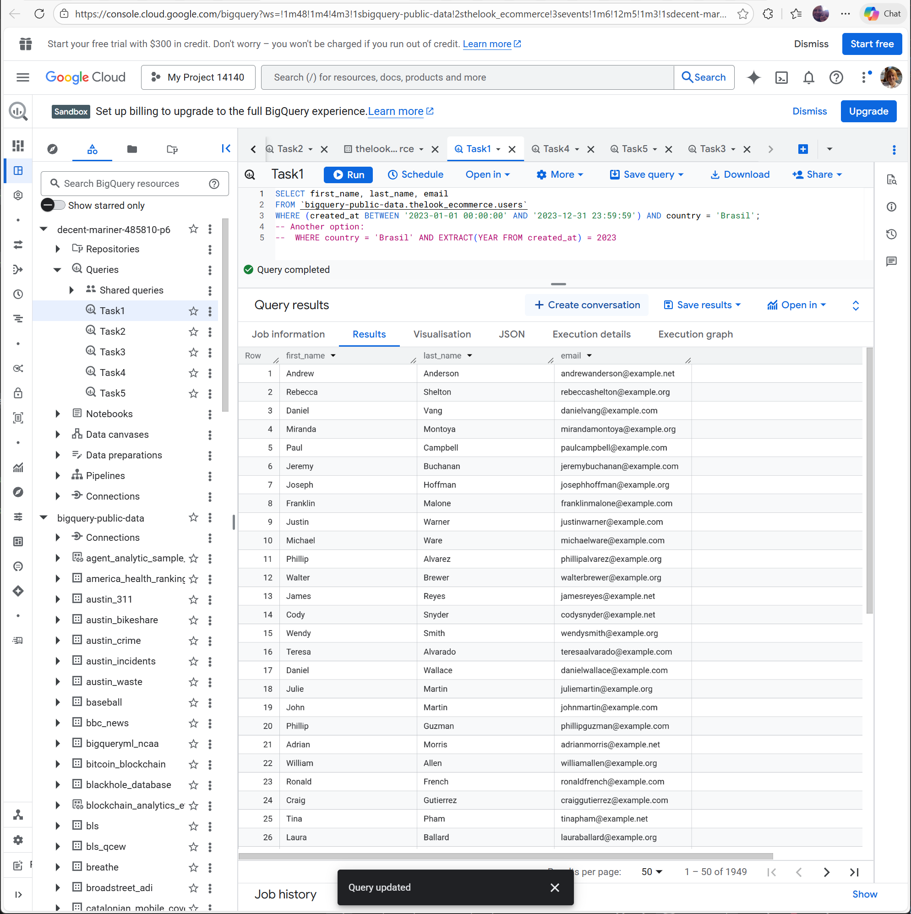

<b>Task 2: Product Categories by Stock Count</b>

 

* **Goal:** Rank all product categories from highest to lowest inventory levels.
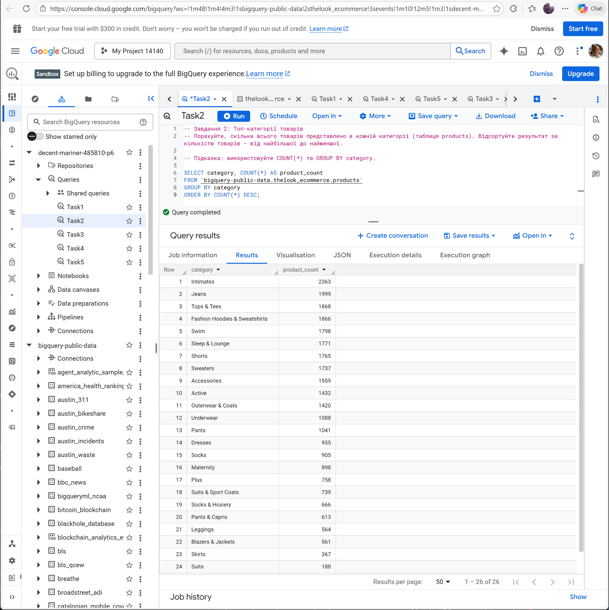

<b>Task 3: Shipped Orders Analysis (JOIN)</b>

 

* **Goal:** Join `orders` and `users` tables to identify successfully shipped orders with customer names.

To analyze orders with their respective customers, I implemented two different SQL strategies:

**Option A: Strict Filtering (WHERE)**
Focuses exclusively on 'Shipped' status.
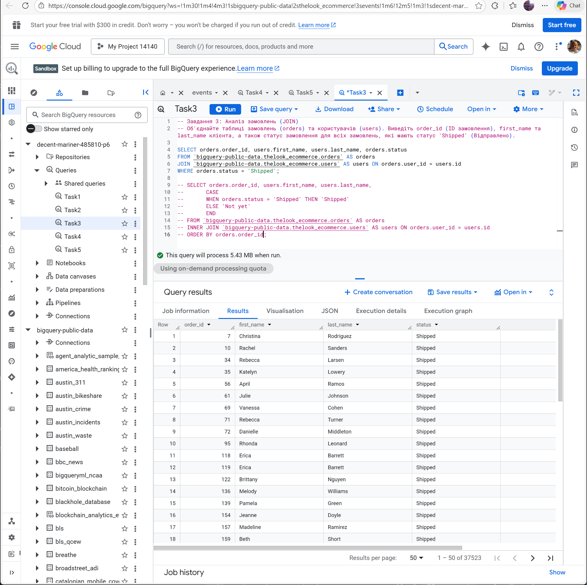

**Option B: Conditional Labeling (CASE)**
Classifies all orders as either 'Shipped' or 'Not yet' for a broader overview.
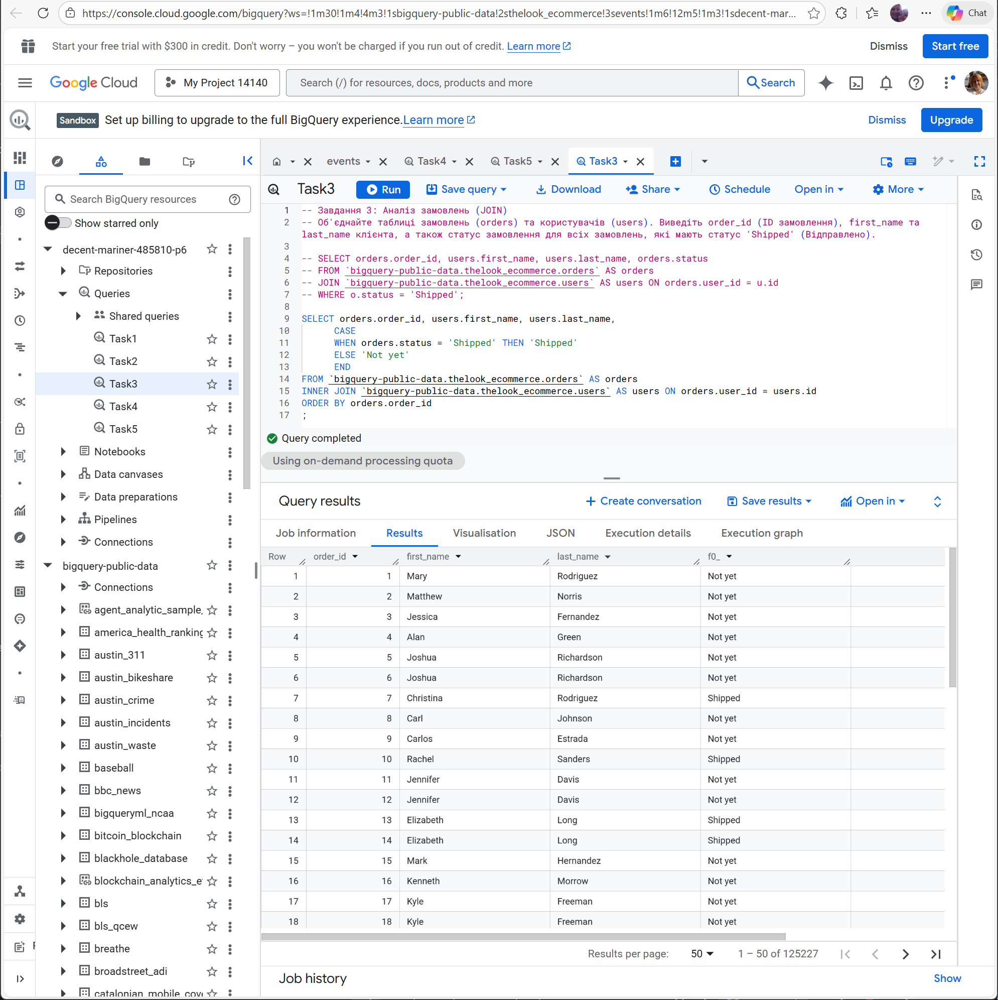

<b>Task 4: Financial High-Value Orders</b>

 

* **Goal:** Identify the TOP-10 most expensive orders based on total `sale_price`.
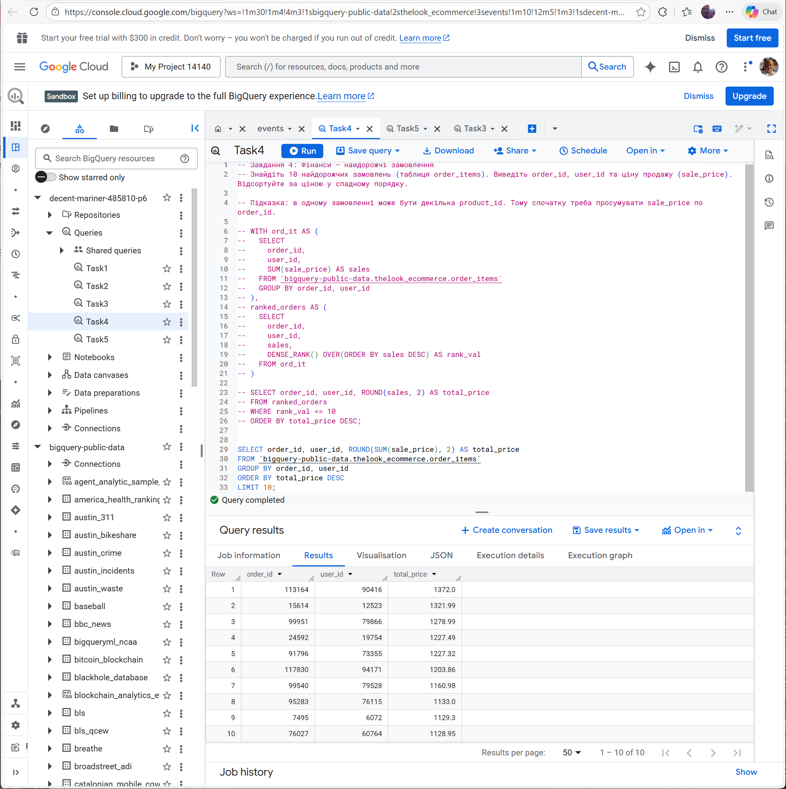

<b>Task 5: Customer Geography (Filtering)</b>

 

* **Goal:** Count unique users per country and filter regions with more than 500 customers.
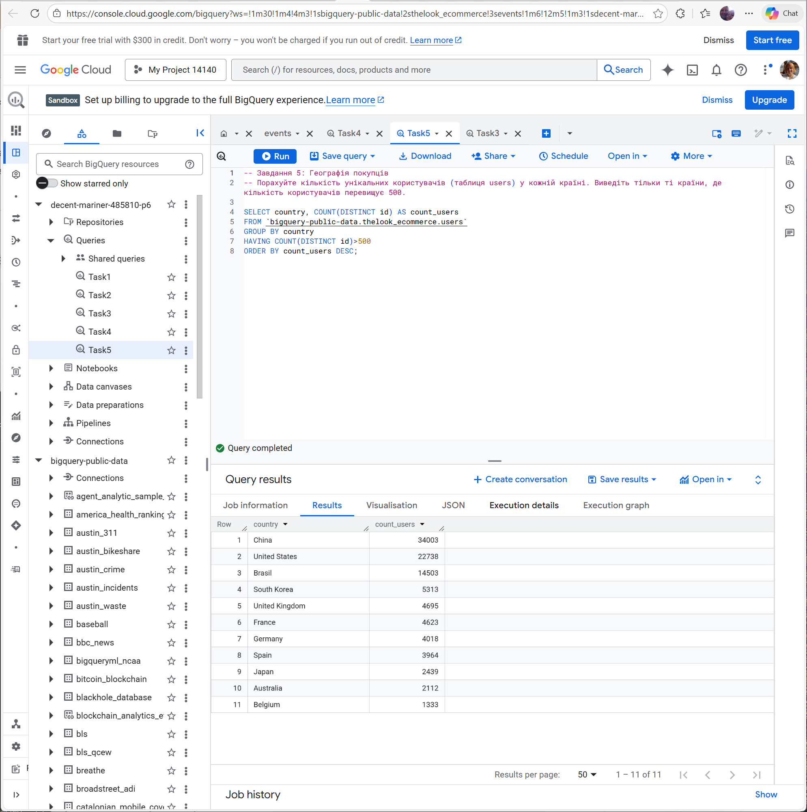

---

### 2. BI Visualization (Tableau)

Created an interactive dashboard to monitor KPIs and identify growth opportunities for marketing optimization.

**Interactive Version:** [Tableau Public Dashboard](https://public.tableau.com/views/EcommerceDatasetforDataAnalysisKaggle/SalesCustomerInsightsDashboard?:language=en-US&publish=yes&:sid=&:redirect=auth&:display_count=n&:origin=viz_share_link)

#### 📈 Dashboard 1: Executive KPI Overview
This dashboard provides a high-level summary of business performance and addresses the following key areas:

1. **Revenue Dynamics:** Tracking total sales trends from January 2022 to the present to identify growth and seasonality.
2. **Discount Effectiveness:** Comparing Average Order Value (Net vs. Gross) for purchases with and without discounts to measure margin impact.
3. **Customer Persona & Category Affinity:** Visualizing which product categories are most popular across different age demographics.

<b>View Dashboard 1 Screenshot</b>

 

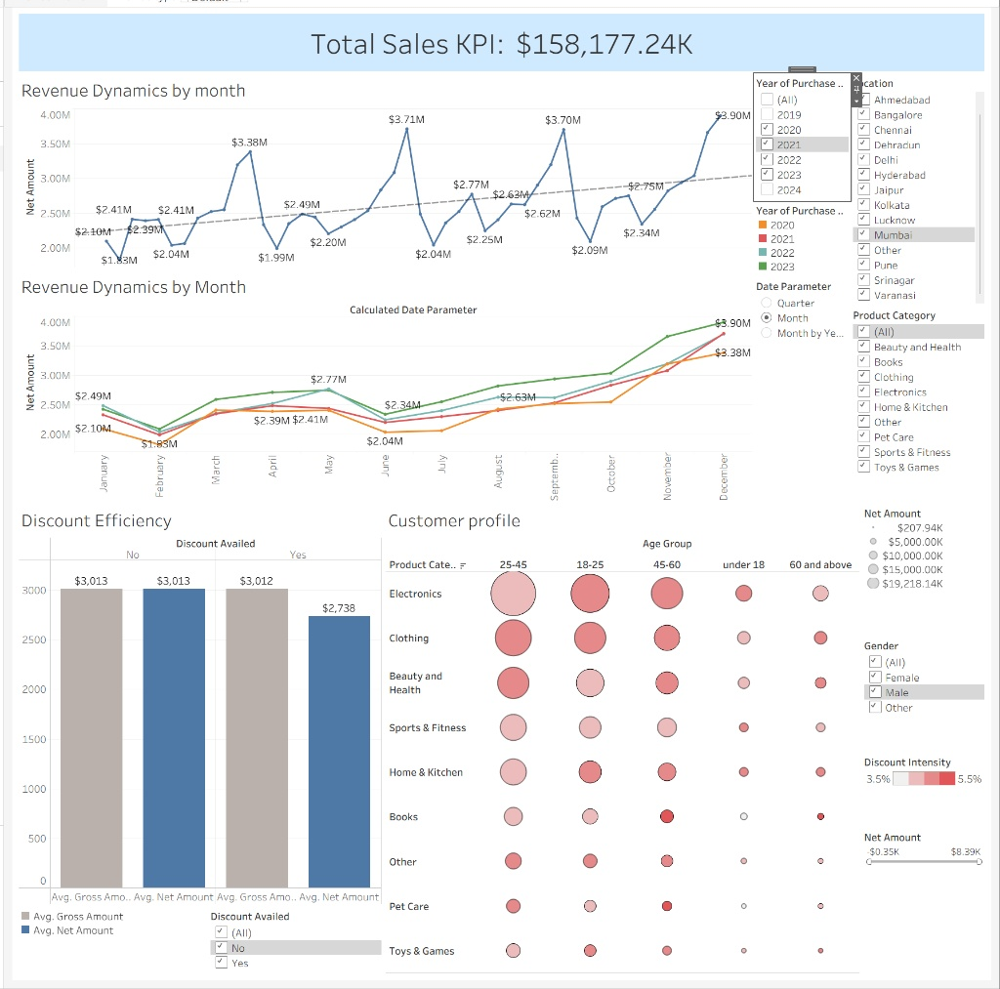

---

#### 📊 Dashboard 2: Strategic Business Case
This dashboard focuses on a deep-dive analytical question regarding customer segment profitability:

* **Analytical Question:** Comparison of Group A (Men) and Group B (Women) across age categories to determine:
    * Which group brings the highest total Net Revenue?
    * Which group has the highest Average Order Value (AOV)?
    * Which segment is more prone to purchasing items with discounts?
* **Conclusion:** Identification of the most "valuable" customer segment for long-term business strategy based on revenue contribution and purchasing behavior.

<b>View Dashboard 2 Screenshot</b>

 

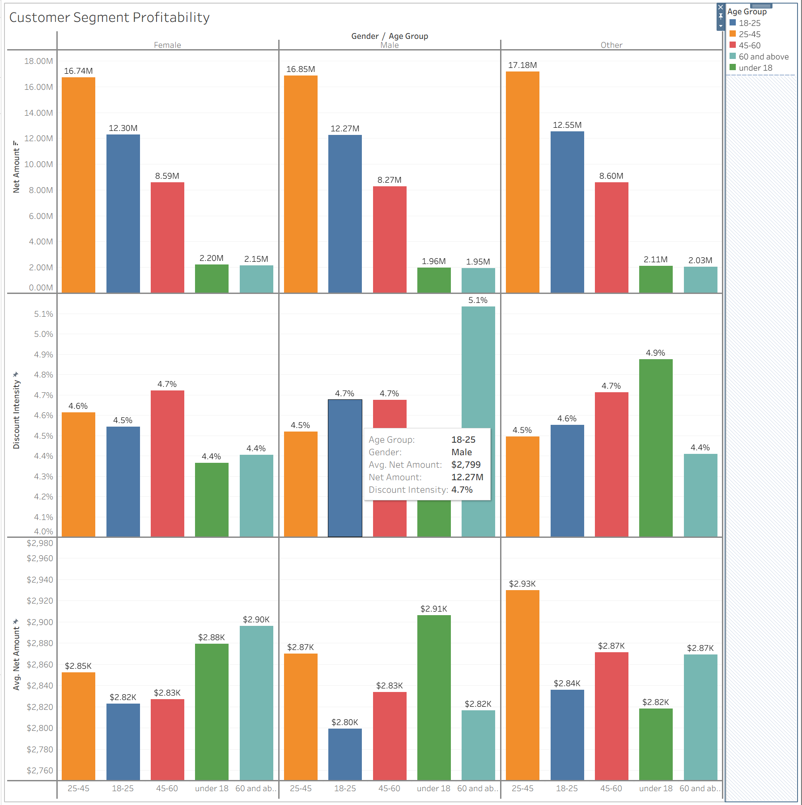

---

#### 🛠 Technical Features
* **KPI Cards:** Direct visibility of Total Sales ($158M+) and volume metrics.
* **Interactive Filters:** Global controls for **Region**, **Year**, and **Category** for personalized data exploration.
* **Unified Design:** Business-standard UI with consistent color palettes and professional naming conventions.

---

### 3. Predictive Modeling (Python)

The core research investigated whether **Age** determines the **Gross Amount** spent using various statistical and machine learning approaches. To find the most accurate predictor, I developed the following models:

1. **Simple Linear Regression:** Treating Age as a continuous numeric variable to find a direct linear trend.
2. **Categorical Linear Regression:** Using One-Hot Encoding for age groups to detect generational shifts.
3. **Random Forest Regressor:** A non-linear approach to check for complex patterns that linear models might miss.
4. **Multiple Linear Regression:** Including additional features (Gender, Payment Method) to identify the true drivers of spending.
5. **Validation Models (3.5 & 3.6):** A final check on refined, outlier-free data to confirm previous findings.

#### 📊 Statistical Visualizations & Data Quality

<b>1. Data Distribution: Before vs. After Cleaning</b>

 

**Initial State (Raw Data):**
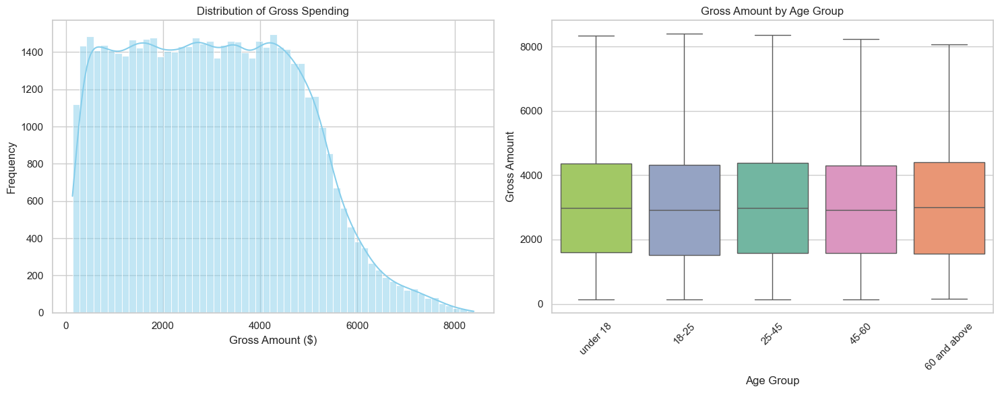

**Refined State (Cleaned Data):**

*Insight: Removing negative values and anomalies ensured the integrity of the regression analysis.*

<b>2. Numeric Analysis (Model 3.5)</b>

 

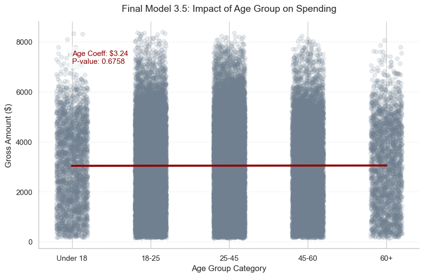
*Finding: The regression line is nearly flat (Coefficient: 3.24), proving that Age has no meaningful numeric impact on transaction volume.*

<b>3. Categorical Analysis (Model 3.6)</b>

 

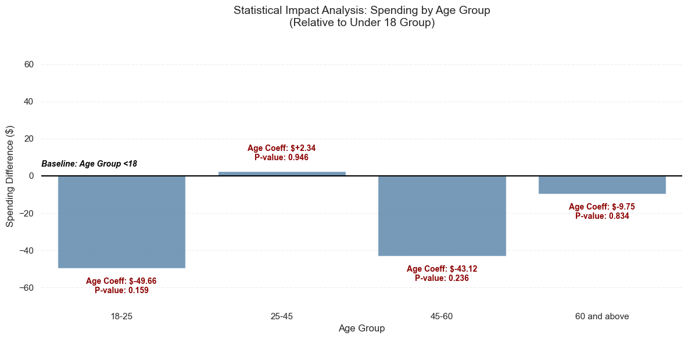
*Finding: High p-values across all age cohorts confirm that no specific generation deviates significantly from the spending baseline.*

---

#### ⚖️ Model Comparison Table

| Model | R² | MAE | Intercept | Key Effects | Statistical Significance | Interpretation |
|:---|:---|:---|:---|:---|:---|:---|
| **3.1 Simple Linear Regression** | -0.00016 | $1433.87 | 3020.00 | Age = 8.86 | p = 0.3073 (Not sig.) | Age has no significant linear effect |
| **3.2 Categorical Regression** | 0.00008 | $1433.68 | 3060.88 | 18–25: -49.66 25–45: 2.34 | All p-values > 0.15 | No differences between age groups |
| **3.3 Random Forest** | 0.00007 | $1433.68 | Avg: $3045 | Imp: 18–25 (0.37) | Not applicable | Confirms very low predictive power |
| **3.4 Multiple Regression** | -0.00059 | $1433.99 | $2965.07 | **PhonePe: +129.60** | **Significant (p=0.008)** | Spending driven by Payment Method |
| **3.5 Final Numeric Validation** | 0.00000 | $1438.57 | 3034.39 | Age = 3.24 | p = 0.6758 (Not sig.) | Confirms weak age effect |
| **3.6 Final Categorical Validation** | 0.00020 | $1438.41 | $3066.86 | 25–45: 2.34 (p=0.94) | All insignificant | Age groups do not affect spending |

---

## 📈 Key Findings & Strategic Insights

1. **Age is "Noise":** Across all models (Linear and Random Forest), Age explains nearly **0%** of the variance in spending. Demographics alone are insufficient for predicting customer value.
2. **Behavior Over Demographics:** The **Multiple Linear Regression (3.4)** identified that **Payment Method (PhonePe UPI)** and **Gender (Other)** are more significant predictors than age, with PhonePe adding ~$130 to the average transaction.
3. **Strategic Pivot:** Marketing strategy should shift from "Age-based" targeting to "Behavioral-based" triggers, focusing on payment preferences and high-value product categories identified in the SQL and Tableau stages.
